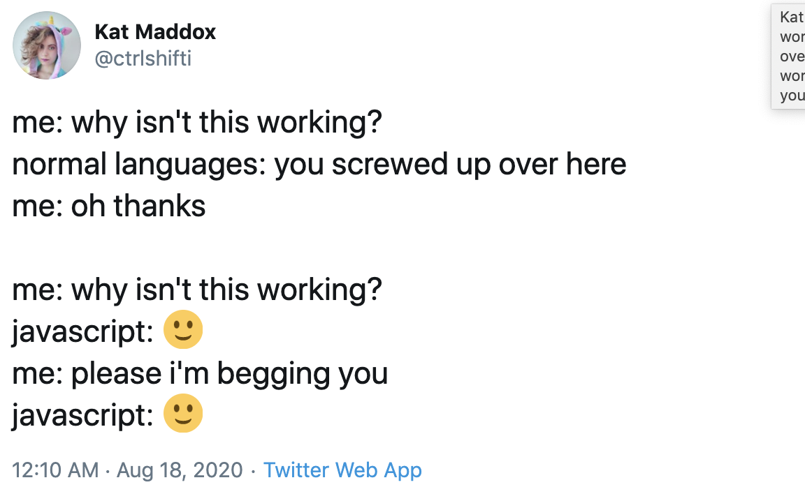

## Links:
* [Slides available here](https://docs.google.com/presentation/d/1EaHFVLpQbl3xGxsySenoWBRGCuXN3-CgKpwONx1PpzE/edit?usp=sharing)
* ["Wat" Gary Bernhardt video available here](https://www.destroyallsoftware.com/talks/wat)

## Note from Nicky:
More detailed notes on the DOM are available in the [DOM-Basics.md](./DOM-Basics.md) file in this directory. This README largely reflects information from the slides.

## Expectations:
* This mod is faster because you can go faster.
* It also serves as a crash course in debugging and code organization.

* I will be teaching things in multiple different ways
* "Just enough JavaScript"

## Why is JavaScript great?
* Every browser will run it for you
* It allows you to add interactivity without refreshing the page
* I guess we're doing everything in JS now

## History of JS

### Early Days
* Created by Brandon Eich at Netscape in 10 days in 1995
* Browser Wars still leave us with legacy JavaScript implementations (and weirdness)
* Was not a highly respected programming language for about 10 years
* Based off of functional languages with some object-oriented patterns
* Applications like Google Maps and Gmail were where JavaScript shone again

### Standards
* The standard for JavaScript implementations is called ECMAScript
* The standard is updated yearly and the standard for that year is called ECMAScript 20xx (or ES 20xx)
* We can use transpiling to write JavaScript according to the standard we want and convert it to code that can be used for the majority of JavaScript applications

## Three pillars of Web Development:
* HTML
* CSS
* JS

## Three Pillars of JS:
* Event Listeners
* DOM manipulation
* Communicating with the Server

## The Document Object Model

### What is the DOM?
Object-oriented representation of the webpage which allows programs to manipulate the properties and contents on the page
When HTML is compiled, the DOM is created based on that HTML
Javascript is a language created to manipulate the DOM
